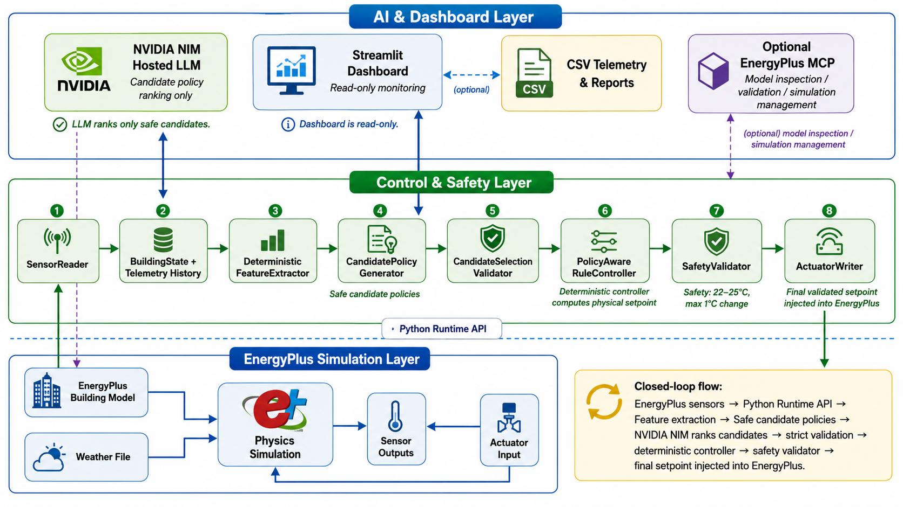

# EnergyPlus Supervisory Control and MCP Simulation
I have uploaded the files in drive because I was not able to upload zip files on HirePro and I was running out of time
PoC Video Link: https://drive.google.com/file/d/1dtdfqKZdC4147xxeKeVmKh6LiLwnYWBn/view?usp=sharing
System Architecture Document Link: 
This project contains two deliberately separate EnergyPlus paths:

1. The validated Runtime API controller performs timestep sensing, bounded
   NVIDIA candidate ranking, deterministic policy control, final safety
   validation, and actuator injection.
2. The official LBNL EnergyPlus MCP service inspects, validates, and runs
   isolated uploaded models. Uploaded models use standard simulation unless a
   deterministic compatibility check proves every controller requirement.

The MCP integration does not modify callback registration, sensor handles,
actuator handles, `PolicyAwareRuleController`, or the 22-25 C / 1 C physical
safety boundary.

## Architecture



The Runtime API closed loop and the MCP upload workflow are deliberately
separate. NVIDIA NIM ranks bounded supervisory candidates in the control path;
the deterministic controller and safety validator retain physical authority.
The MCP agent inspects isolated uploaded models and cannot access Runtime API
actuators.

## Repository Layout

- `src/energyplus/`: Runtime API runner, callbacks, sensors, and actuators
- `src/controller/`: state, policy, decision, validation, and pipeline logic
- `src/agent/` and `src/mcp/`: bounded NVIDIA/MCP inspection agent
- `src/simulation_upload/`: package validation and isolated run workspaces
- `src/telemetry/`: CSV telemetry and metrics
- `dashboard/`: read-only Streamlit telemetry and MCP workflow
- `tests/`: unit, boundary, integration, and real-provider gates
- `test_reports/`: curated validation evidence and report index
- `demo_assets/`: safe judge upload bundle

## Install

```powershell
python -m venv .venv
.\.venv\Scripts\Activate.ps1
python -m pip install -r requirements.txt
git clone https://github.com/LBNL-ETA/EnergyPlus-MCP.git ..\EnergyPlus-MCP
python -m pip install -e ..\EnergyPlus-MCP\energyplus-mcp-server
```

The current official `validate_idf` implementation requires the small
compatibility patch documented in
`test_reports/energyplus_mcp_integration_report.md` when used with eppy
0.5.69.

## Configure

Create the project `.env` from `.env.example`. Generate a distinct MCP token:

```powershell
$bytes = New-Object byte[] 32
$rng = [System.Security.Cryptography.RandomNumberGenerator]::Create()
$rng.GetBytes($bytes)
$rng.Dispose()
$token = ([BitConverter]::ToString($bytes)).Replace('-', '').ToLowerInvariant()
```

Put the token in the ignored project `.env` as
`ENERGYPLUS_MCP_TOKEN`. Put the same token in the ignored official-server
`.env` as the `MCP_TOKENS` token. Never reuse `NVIDIA_NIM_API_KEY`.

For the local Windows service:

```text
EPLUS_IDD_PATH=C:\EnergyPlusV26-1-0\Energy+.idd
MCP_TRANSPORT=streamable-http
MCP_HTTP_HOST=127.0.0.1
MCP_HTTP_PORT=8000
MCP_HTTP_PATH=/mcp
MCP_TOKENS=[{"label":"honeywell-demo","token":"<secret>"}]
```

For Docker, set this project variable:

```text
ENERGYPLUS_MCP_SERVER_WORKSPACE_ROOT=/workspace/simulation_workspace
```

The host workspace remains the absolute
`ENERGYPLUS_MCP_WORKSPACE_ROOT`. The client validates host paths first and
then maps only the assigned run to the container mount.

## Start

Local official service:

```powershell
Set-Location ..\EnergyPlus-MCP\energyplus-mcp-server
..\..\Honeywell\.venv\Scripts\python.exe -m energyplus_mcp_server.server
```

Docker:

```powershell
docker compose -f docker-compose.energyplus-mcp.yml build
docker compose -f docker-compose.energyplus-mcp.yml up -d
docker compose -f docker-compose.energyplus-mcp.yml ps
Invoke-RestMethod http://127.0.0.1:8000/health
```

The Compose file initializes its persistent Python virtual-environment volume,
runs the MCP service as a non-root user, and waits on an HTTP health check.
After installing Docker Desktop, restart PowerShell so its CLI is present on
`PATH`.

Start the dashboard:

```powershell
.\.venv\Scripts\streamlit.exe run dashboard\app.py
```

Open `http://localhost:8501`. The existing page shows validated closed-loop
telemetry. Use **Create Simulation** to validate a package, inspect it with
NVIDIA NIM and MCP, and explicitly approve one standard simulation.

## Upload Workflow

- Upload exactly one EnergyPlus 26.1 IDF and one EPW, plus allowlisted text
  support files, or one safe ZIP.
- Press **Validate package**. Invalid paths, binaries, archives, versions, and
  missing schedule CSVs are rejected before MCP or NVIDIA is contacted.
- Press **Validate model** to let NVIDIA NIM select bounded MCP inspection
  tools.
- Review the mode and readiness. Arbitrary models remain standard simulations.
- Press **Run Simulation** to approve one MCP launch.
- Review **Agent Activity**, **Simulation Results**, and **Run History**.

## Tests

```powershell
$env:PYTHONPATH = "src;."
.\.venv\Scripts\python.exe -m unittest discover -s tests -p "test_*.py" -v
```

The real integration evidence and readiness decision are in `test_reports/`.

Rerun the real NVIDIA-to-MCP agent gate after model, prompt, or tool changes:

```powershell
$env:PYTHONPATH = "src;."
.\.venv\Scripts\python.exe tests\nvidia_energyplus_mcp_agent_gate.py
```
